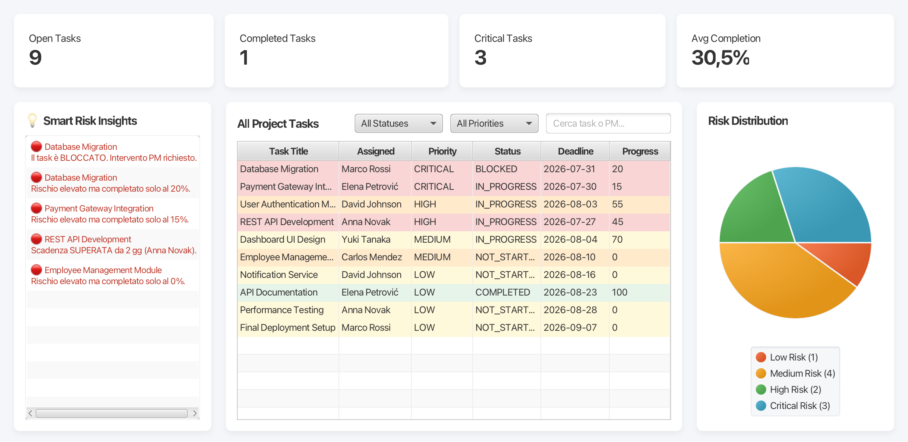

# 📊 Project Risk Dashboard

A JavaFX desktop application that helps Project Managers monitor project health, identify high-risk tasks, and make informed decisions through real-time analytics and intelligent risk detection.

The application simulates a modern Project Management Dashboard by combining task tracking, dynamic KPI monitoring, interactive filtering, risk analysis, and smart project insights within a clean and intuitive user interface.

---

## 🚀 Key Features

- 📋 Task Management Dashboard
- 🔍 Live Search & Multi-Filter System
- 📊 Interactive Risk Distribution Pie Chart
- 📈 Project KPI Cards
- 🚨 Smart Risk Insights Engine
- ⚠️ Automatic Risk Classification
- 🎯 Dynamic Risk Scoring Algorithm
- 📅 Deadline Monitoring
- ⏱ Estimated vs Actual Hours Analysis
- 🎨 Dynamic Risk-Based Color Coding

---

## 🏗️ Project Architecture

The application follows an Object-Oriented and MVC-inspired architecture, separating data models, business logic and user interface components to improve maintainability and scalability.

### Project Structure

```
src
└── main
    └── java
        └── com.andelastojanovic.projectriskdashboard
            ├── controller
            ├── data
            ├── manager
            ├── model
            ├── service
            ├── util
            └── view
```

### Main Components

- **Model** – Represents tasks, priorities, statuses and risk levels.
- **Service** – Implements the intelligent Risk Analyzer algorithm.
- **Manager** – Handles task collection and business logic.
- **Data** – Generates sample project data for demonstration.
- **View** – JavaFX interface with dashboard components.
- **Controller** – Connects user interactions with the application logic.

---

## 🧠 Intelligent Risk Analysis

The dashboard evaluates every task using a custom scoring algorithm designed to simulate how Project Managers identify potential project risks.

Each task receives a dynamic risk score based on multiple project indicators:

- 🔴 Priority level
- 📅 Remaining time before the deadline
- 🚧 Current task status
- 📈 Completion percentage
- ⏱ Estimated vs. Actual working hours

The final score is automatically classified into four different risk categories:

| Risk Level | Meaning |
|------------|---------|
| 🟢 Low | Task is under control |
| 🟡 Medium | Requires monitoring |
| 🟠 High | Immediate attention recommended |
| 🔴 Critical | Action required immediately |

This risk evaluation is automatically updated whenever project data changes, allowing the dashboard to provide real-time project health monitoring.

---

## 📈 Dashboard Components

The application provides a complete project monitoring environment including:

- 📋 Interactive Task Table
- 🔍 Live Search Bar
- 🎯 Priority & Status Filters
- 📊 Risk Distribution Pie Chart
- 📌 Project KPI Cards
- 🚨 Smart Risk Insights Panel
- 🎨 Dynamic Risk Coloring
- 📈 Real-time Dashboard Updates

Every dashboard component automatically refreshes after filters or search criteria are applied, keeping the displayed statistics and risk analysis synchronized.

---

## 📸 Screenshots

### Dashboard Overview



---

## 🛠️ Technologies Used

- **Java 21**
- **JavaFX**
- **Gradle**
- **MVC-inspired Architecture**
- **Object-Oriented Programming (OOP)**
- **Git & GitHub**
- **IntelliJ IDEA**

---

## ▶️ Running the Project

### Clone the repository

```bash
git clone https://github.com/andelastojanovic/Project-Risk-Dashboard.git
```

### Open the project

Open the project using **IntelliJ IDEA**.

### Run

Execute the `HelloApplication.java` file.

The application will launch showing the Project Risk Dashboard with sample project data.
```

---

## 💡 Future Improvements

Future versions of the application may include:

- Database integration (MySQL / PostgreSQL)
- User authentication
- Task editing directly from the dashboard
- Export reports to PDF or Excel
- Email notifications for critical tasks
- Team performance analytics
- Dark Mode
- REST API integration

---

## 👩‍💻 Author

**Andela Stojanovic**

Engineering Management Student | Aspiring Project Manager | Java Developer

- LinkedIn: https://www.linkedin.com/in/andelastojanovic/
- GitHub: https://github.com/andelastojanovic
